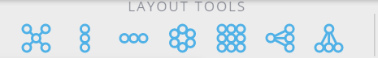
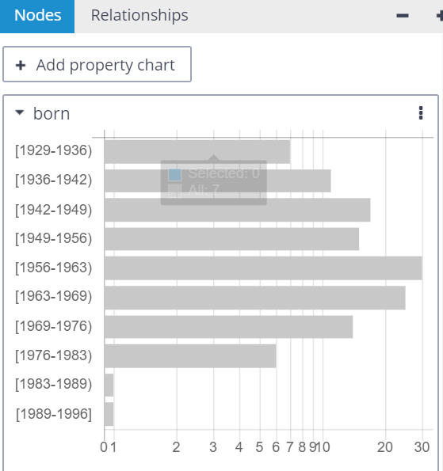

# 요구사항 명세서

|**Category**|**RQ-ID**|**요구사항명**|**요구사항 내용**|**날짜**|**작성자**|
|:---:|:---|:---:|:----------:|:---:|:---:|
|공통|Common-01|개발 Platform|JAVA를 기반으로 개발|2021-09-14|서태환|
||Common-02|OPEN 소스이용관련|DBeaver를 기반으로 Gephi Lib를 이용하여 구현한다.|2021-09-14|서태환|
||Common-03|Tool 방향|탐색&분석을 목표하여 개발(e.g.Neo4J Bloom)<br>ReadOnly만 가능하며 추가,삭제 기능은 제공하지 않는다.|2021-09-14|서태환|
||Common-04|DBMS와통신|Apache Tinkerpop에 Gremlin을 이용한 통신을 사용한다.|2021-09-14|서태환|
|연결관련 View|Conn-View-01|DBMS 다중서버 연결|다중 서버 연결 기능을 제공해야 한다.<br>(탐색창을 이용하여 다중연결 제공하며, 추가,삭제가 가능하도록 한다.)|2021-09-13|서태환|
|시각화 View|V-View-01|기본기능|Text 또는 Query로 검색 된 결과를 vertex와 edge 형태로 시각화하여 표현한다.|2021-09-14|서태환|
||V-View-02|확대/축소|시각화된 정보는 확대/축소 가능해야 한다.|2021-09-14|서태환|
||[V-View-03](#v-view-03)|정렬 기능|정렬기능을 버튼으로 나열하여 원하는 Style로 정렬할수 있도록 한다.<br>(세로정렬,가로정렬,원형등)|2021-09-14|서태환|
||V-View-04|선택 기능|Vertex 또는 Edge 선택 시 개별,복수,범위 선택이 가능하도록 한다.|2021-09-14|서태환|
||V-View-05|색상 변경기능|Vertex는 색상 변경이 가능하도록 한다.<br> 기본 색상은 파란색이며, 개별,복수, 범위를 선택하여 색상을 변경 할수 있다.|2021-09-14|서태환|
||V-View-06|최대 표현개수 제한 기능|User 선택에 따라 표현 개수를 제한할수 있도록 한다.<br> Default 개수 및 최대 개수는 성능테스트 후 결정된다.|2021-09-14|서태환|
||V-View-07|MiniMap 제공|MiniMap을 통해 Main View 포인트로 이동가능하도록 한다.|2021-09-14|서태환|
||V-View-08|결과 수정기능|시각화된 결과를 삭제, 편집 할 수 있도록 하며,<br> Undo, Redo 기능을 지원한다. |2021-09-14|서태환|
||V-View-09|결과 출력 선택기능|Label, Properties, Relatonship등 원하는 Text만 출력하도록 지원<br> 기본 출력은 Label이다.|2021-09-14|서태환|
||V-View-10|Highlight기능|선택된 Vertex부터 Relationship까지 하이라이트 표시기능 제공하며,<br> Vertex에 단일선택만 가능하다.|2021-09-14|서태환|
|기능|Func-01|Pattern 기능|시각화된 결과에서 Pattern과 동일한 결과를 찾을 수 있는 기능을 제공한다.|2021-09-14|서태환| 
||[Func-02](#func-02)|Export 기능|CSV Or Image 파일로 내보내기 기능 제공한다.<br> CSV 파일은 검색결과를 Vertex와 Edge 별로 내보낼수 있으며 <br> 해당 정보는 Lable, Property정보를 포함한 형태.<br> image 파일은 시각화된 결과를 png파일로 내보낸다.|2021-09-14|서태환|
|검색|Search-01|전체검색기능|전체 Vertex에서 Text로 검색 할 수 있는 기능 제공한다. (DEFAULT)|2021-09-14|서태환|
||Search-02|부분검색기능|Vertex ,Properties, edge 중 단일,복수선택하여 해당 범위 내에서만 Text로 검색할수 있는 기능을 제공한다. (OPTION 추가)|2021-09-14|서태환|
|Query View|Query-01|Query View 제공|규약된 언어를 입력 할 수 있는 Query View를 제공한다. |2021-09-14|서태환|
||Query-02|Query 저장기능|Query View에서는 자주 사용하는 query를 저장할수 있는 기능을 제공한다.|2021-09-14|서태환|
|상세정보 View|[Detail-01](#detail-01)|상세정보 View 제공|Vertex 또는 Edge 선택시 Properties를 확인 할수 있는 View 제공한다.|2021-09-14|서태환|
|속성 Chart View|[P-Chart-01](#p-chart-01)|결과 단순화표현|시각화 결과 정보를 Property 선택을 통해 Table, chart등으로 표현한다.<br>(검색된 결과에서 property 종류를 검색하여 list로 만들고 property를 선택하여 결과를 만듬) |2021-09-14|서태환|

---

## 추가 정보


### V-View-03


[e.g.) Neo4j Graphlytic Desktop 화면]

위 그림과 같이 메뉴 버튼이 제공되며, 선택시 시각화 결과가 정렬된다.

### Func-01
설명 추가 예정

### Func-02
검색 및 query 결과가 Movie와 Actor에 관계로 검색 했을 경우
vertex기준으로 CSV를 저장을 하면 아래와 같습니다.
```
"id","lable","propery_title","propety_director","name","born"
"v1","Movie","matrix","Wachowskis",,
"v2","Actor",,"Keanu Charles Reeves","1964",
```
edge기준으로 저장을 하면 아래와 같습니다.
```
"id","lable"
"e1","acted_in"
```

### Detail-01
Vertex 또는 edge를 선택하면 아래와 같은 정보가 view에 나타납니다.
```
type  : vertex
label : movie
---propery---
title : matrix
director : Wachowskis
```

### P-Chart-01


[e.g.) Neo4j Graphlytic Desktop 화면]

시각화 결과에서 가져온 property list를 만들고 해당 property를 선택하면

table or chart 형식으로 출력합니다.
